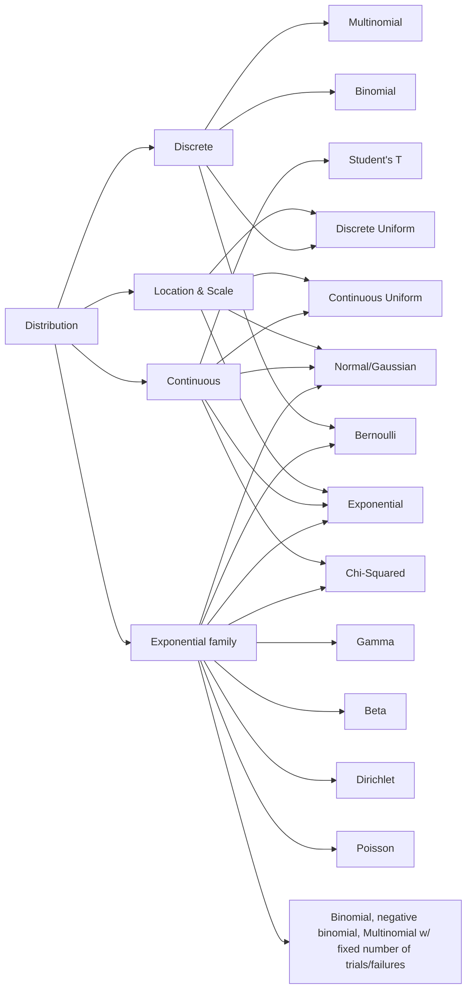
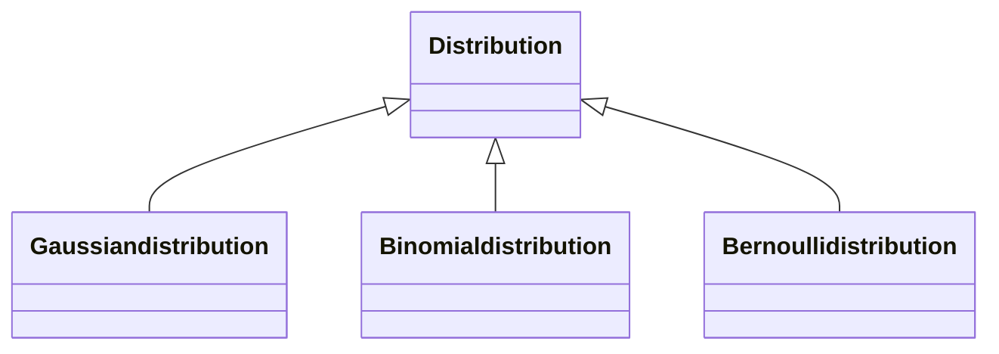

```mermaid
graph LR

    A[Distribution] --> B[Discrete];
    A --> C[Continuous];
    A --> E[Location & Scale];
    A --> D[Exponential family];

    D --> gauss[Normal/Gaussian];
    D --> gamma[Gamma];
    D --> exp[Exponential];
    D --> beta[Beta];
    D --> chi2[Chi-Squared];
    D --> bern[Bernoulli];
    D --> dir[Dirichlet];
    D --> poi[Poisson];
    D --> fixed[Binomial, negative binomial, Multinomial w/ fixed number of trials/failures]

    B --> mul[Multinomial];
    B --> bi[Binomial];
    B --> duni[Discrete Uniform];
    B --> bern;

    C --> stu[Student's T];
    C --> cuni[Continuous Uniform]
    C --> gauss;
    C --> chi2;
    C --> exp;

    E --> gauss;
    E --> duni;
    E --> cuni;
    E --> exp;

```

---

```mermaid
classDiagram
    Distribution <|-- Gaussiandistribution
    Distribution <|-- Binomialdistribution
    Distribution <|-- Bernoullidistribution
```
